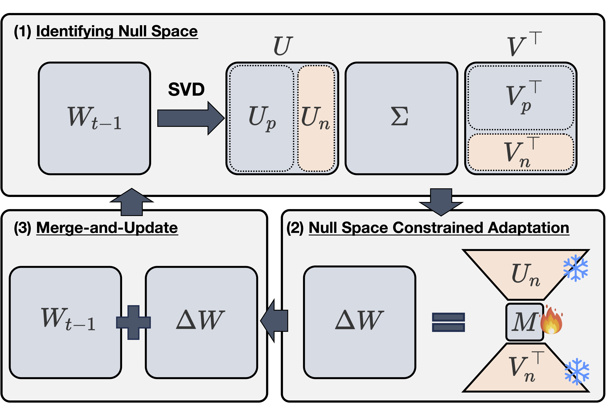

<div align="center">

# [ICLR 2026] Memory-Free Continual Learning with Null Space Adaptation for Zero-Shot Vision-Language Models

### In-place knowledge accumulation for continually evolving foundation models

[](https://proceedings.iclr.cc/paper_files/paper/2026/hash/ad217e0c7fecc71bdf48660ad6714b07-Abstract-Conference.html)
[](https://arxiv.org/abs/2510.21175)

</div>

Foundation models should not have to choose between remaining static and growing forever.

NuSA-CL treats the low-energy spectral directions of a model's current weights as **writable capacity**. For every new task, it identifies an approximate null space, learns a small update that is persistently confined to that space, and merges the update back into the backbone. The model accumulates knowledge in place: no replay data, no teacher model, no task-specific module library, and no parameter growth over time.

This repository provides the official CLIP implementation and MTIL experiments. The underlying optimization primitive acts on weight matrices rather than on a particular modality. We therefore view NuSA-CL as a general approach to knowledge accumulation in foundation models; extending it beyond CLIP is a research direction, not an empirical claim made by this release.

## The idea

Let the current weight matrix be

```math
W_t = U \Sigma V^\top.
```

We select the smallest principal subspace that explains a fraction $\rho$ of the spectral energy. The remaining low-energy directions define an approximate null space with bases $U_n$ and $V_n$. Adaptation is restricted to

```math
\Delta W_t = U_n M_t V_n^\top,
```

where $U_n$ and $V_n$ are frozen and only the zero-initialized matrix $M_t$ is learned. After training,

```math
W_{t+1} \leftarrow W_t + \Delta W_t.
```

The merged model becomes the starting point for the next task, so the subspace is always recomputed from the model's **accumulated state**.

<p align="center">
  
</p>

<p align="center">
  <em>Figure 1. The NuSA-CL framework.</em>
</p>

### Why this is knowledge accumulation

- **The model is its own memory.** The adaptation subspace is derived from the current parameters, without past examples, gradients, or features.
- **Knowledge is internalized.** Every update is merged into the backbone instead of being left in a growing collection of side modules.
- **Capacity stays fixed.** The low-rank workspace is reset and reused after merging; no task-specific copy is accumulated, so its size does not grow with the number of tasks.
- **The constraint persists during learning.** Unlike SVD-based initialization alone, the update cannot drift back into the principal subspace while it is optimized.

## Beyond CLIP

NuSA-CL is formulated for a dense weight matrix $W$, not specifically for image-text contrastive learning. The same principle can be investigated in:

- attention projections and feed-forward layers of language models;
- vision transformer backbones;
- multimodal encoders and projectors in VLMs and MLLMs;
- continually adapting perception and policy backbones in vision-language-action models.

The current code wraps the Q/K/V/O projections of CLIP attention layers, and the current evidence covers CLIP ViT-B/16 on continual vision-language benchmarks. Applying NuSA-CL to another foundation model requires a model-specific layer wrapper and an appropriate continual evaluation protocol.

## Main results

Full-shot MTIL, 11 sequential datasets, CLIP ViT-B/16. `Transfer` measures zero-shot performance on future tasks, `Avg.` averages the complete task-by-evaluation matrix, and `Last` is the final model's mean accuracy.

| Method | Trainable params | External storage | Transfer ↑ | Avg. ↑ | Last ↑ |
|---|---:|---:|---:|---:|---:|
| Continual-FT | 149.6M | None | 44.6 | 55.9 | 77.3 |
| LoRA† | 15.7M | None | 63.9 | 70.1 | 79.9 |
| MiLoRA† | 15.7M | None | 62.8 | 68.7 | 77.4 |
| InfLoRA† | 7.8M | GPM, 9 MB | 66.2 | 74.2 | **83.6** |
| **NuSA-CL** | **1.5M** | **None** | **68.6** | **75.1** | 82.8 |

† Re-implemented on CLIP under the shared multimodal adaptation protocol. Full Fine-Tuning and ZSCL used four GPUs in the paper; PEFT methods used one GPU.

The cleaned implementation reproduces the NuSA-CL result at seed 42:

| Implementation | Transfer ↑ | Avg. ↑ | Last ↑ |
|---|---:|---:|---:|
| Paper | 68.60 | 75.10 | 82.80 |
| This release | 68.71 | 75.09 | 82.74 |

## Supported methods

All PEFT methods can target the text encoder, vision encoder, or both, and any subset of Q/K/V/O projections.

| Method | Initialization | Trainable component | Past-task storage |
|---|---|---|---:|
| `lora` | Kaiming A, zero B | A and B | None |
| `milora` | Minor singular components of W | A and B | None |
| `inflora` | Feature/GPM basis for K/V | B | GPM |
| `nusa` | Approximate null space of W | M only | None |
| `full_ft` | Pre-trained weights | Backbone | None |

The InfLoRA implementation is a CLIP adaptation. Under the paper protocol, adapters are attached to Q/K/V/O, while the feature-based basis initializes K/V and Q/O retain frozen random bases. Passing `ADAPTER_PARAMS="k v"` enables the K/V-only variant.

## Installation

```bash
conda create -n nusa-cl python=3.10 -y
conda activate nusa-cl
pip install -r requirements.txt
```

The code uses the CLIP implementation included in this repository. A CUDA-capable PyTorch installation is recommended for the full MTIL sequence.

## Data

Set one root directory for the MTIL datasets. Torchvision-backed datasets are downloaded when supported; datasets requiring manual preparation should follow their torchvision directory layout.

```bash
export DATA_LOCATION=/path/to/mtil-data
export MTIL_DATASETS=Aircraft,Caltech101,CIFAR100,DTD,EuroSAT,Flowers,Food,MNIST,OxfordPet,StanfordCars,SUN397
```

The default task order is:

```text
Aircraft → Caltech101 → CIFAR100 → DTD → EuroSAT → Flowers →
Food → MNIST → OxfordPet → StanfordCars → SUN397
```

## Run NuSA-CL

### One task

```bash
python -m src.main \
  --method nusa \
  --train-dataset Aircraft \
  --eval-datasets "$MTIL_DATASETS" \
  --data-location "$DATA_LOCATION" \
  --encoder both \
  --position all \
  --params q k v o \
  --rank 128 \
  --cutoff 0.95 \
  --iterations 1000 \
  --lr 3e-4 \
  --save output/nusa_seed42
```

Continue with the merged checkpoint from the preceding task:

```bash
python -m src.main \
  --method nusa \
  --train-dataset Caltech101 \
  --eval-datasets "$MTIL_DATASETS" \
  --data-location "$DATA_LOCATION" \
  --load output/nusa_seed42/Aircraft.pth \
  --save output/nusa_seed42
```

### Full MTIL sequence with Slurm

The submission script runs all 11 datasets sequentially inside one job:

```bash
DATA_LOCATION=/path/to/mtil-data \
  scripts/submit_mtil.sh nusa nusa_seed42
```

Use the same interface for the baselines:

```bash
scripts/submit_mtil.sh lora lora_seed42
scripts/submit_mtil.sh milora milora_seed42
scripts/submit_mtil.sh inflora inflora_qkvo_seed42
scripts/submit_mtil.sh full_ft full_ft_seed42
```

InfLoRA K/V-only:

```bash
ADAPTER_PARAMS="k v" \
  scripts/submit_mtil.sh inflora inflora_kv_seed42
```

Resume a stopped sequence from the next dataset:

```bash
START_DATASET=OxfordPet \
RESUME_FROM="$PWD/output/nusa_seed42/MNIST.pth" \
  scripts/submit_mtil.sh nusa nusa_seed42
```

Common environment overrides include `SEED`, `ITERATIONS`, `BATCH_SIZE`, `BATCH_SIZE_EVAL`, `WARMUP_STEPS`, `PARTITION`, `TIME_LIMIT`, `MEMORY`, `CPUS_PER_TASK`, and `EXCLUDE_NODES`.

## Repository layout

```text
src/
├── methods/
│   ├── nusa.py       # frozen null-space bases, trainable M
│   ├── lora.py       # standard LoRA and CLIP layer wrapping
│   ├── milora.py     # minor-component initialization
│   ├── inflora.py    # GPM-based CLIP adaptation
│   └── full_ft.py    # continual full fine-tuning
├── loralib/          # LoRA-aware attention layers
├── datasets/         # MTIL datasets
├── models/           # evaluation utilities
├── args.py
└── trainer.py
scripts/
├── run_mtil.sh       # sequential 11-task runner
└── submit_mtil.sh    # Slurm launcher
```

## Citation

```bibtex
@inproceedings{jo2026nusacl,
  title     = {Memory-Free Continual Learning with Null Space Adaptation for Zero-Shot Vision-Language Models},
  author    = {Jo, Yujin and Kim, Taesup},
  booktitle = {International Conference on Learning Representations},
  pages     = {106089--106106},
  year      = {2026},
  url       = {https://proceedings.iclr.cc/paper_files/paper/2026/hash/ad217e0c7fecc71bdf48660ad6714b07-Abstract-Conference.html}
}
```

## Acknowledgements

This codebase builds on [ZSCL](https://github.com/Thunderbeee/ZSCL) and the original [CLIP](https://github.com/openai/CLIP) implementation. We also thank the authors of LoRA, MiLoRA, and InfLoRA, whose methods are included as comparison baselines.

## License

Released under the [MIT License](LICENSE).
